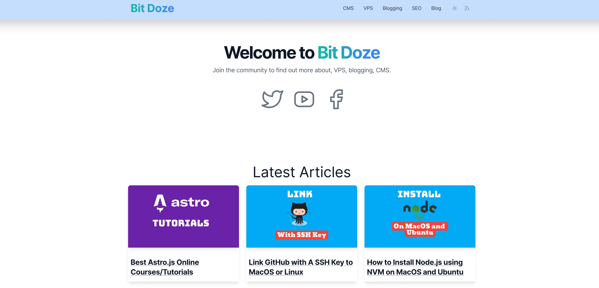

# Bit Doze

A project build from the [🌀 astrowind.vercel.app](https://astrowind.vercel.app/) 

Template was modified to be used on [bitdoze.com](https://www.bitdoze.com)

## Modifications Done

- added  astro-embed
- Modified the homepage to show only social and latest posts on a more nice format
- modified the blog archive layout to grid
- added plausible analytics
- modified links to include "/" at the end to not be redirected any more
- change the header color
- added the index to categories

 

 

## Next Modifications
- to add latest posts on homepage no manual add
- to add latest videos on homepage
- to add a related post section
- to add video open graph to the articles with videos